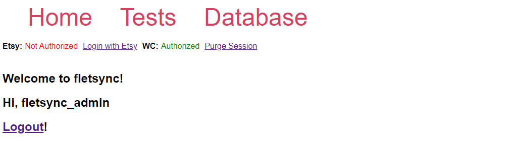
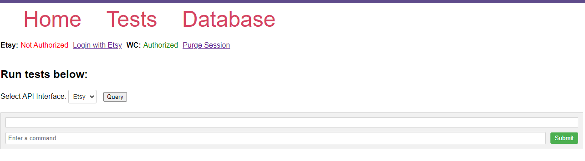
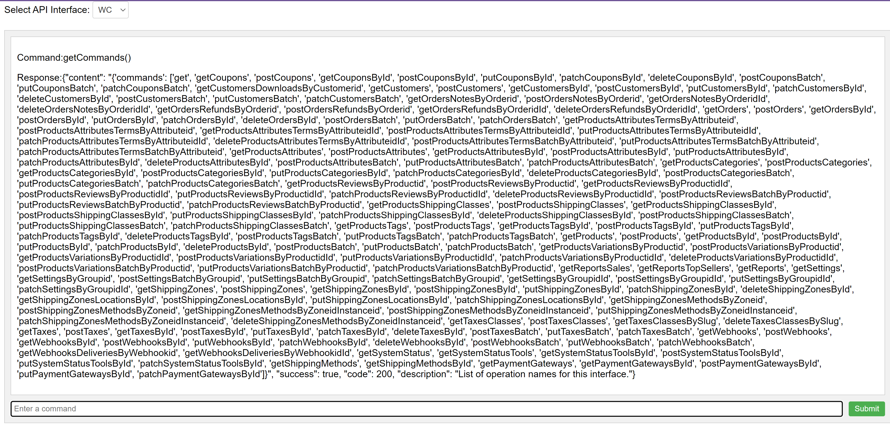

## Flask Storefront Synchronization Tool
### (fletsync)

This project was created to assist me in running my Mom's craft website at craftsru.com. I wanted to be able to 
synchronize changes between multiple storefronts that represent the same store. For example,
using the woo-commerce database on craftsru as master, any changes that happen to the items on that database are 
replicated to child databases. Likewise, any change that happens to a child database is replicated to 
the master database.

### Completed Milestones:

#### OpenAPI_Interface:
#### Capable of parsing openapi specifications into an interface suitable for guard-railing communication between an app and a remote API.

#### UI: 
#### Console allows access to generated openapi commands.
    